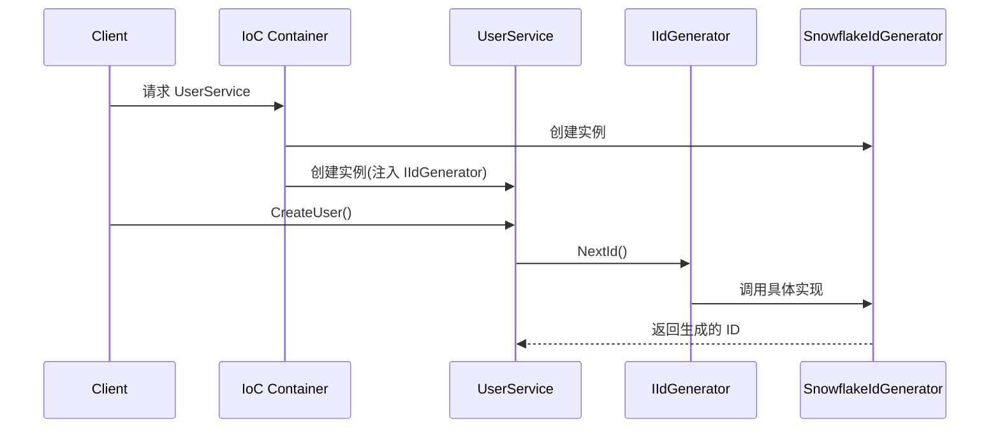

# 依赖倒置原理详解

## 目录
- [什么是依赖倒置](#什么是依赖倒置)
- [核心原则](#核心原则)
- [实际应用](#实际应用)
- [代码示例](#代码示例)
- [优势分析](#优势分析)

## 什么是依赖倒置

依赖倒置原则（Dependency Inversion Principle，DIP）是面向对象设计的一个核心原则，它是实现松耦合设计的重要手段。这个原则包含两个核心思想：

1. 高层模块不应该依赖低层模块，两者都应该依赖于抽象
2. 抽象不应该依赖于细节，细节应该依赖于抽象

## 核心原则

### 1. 依赖抽象而非实现

传统分层架构：
```
应用层 -> 领域层 -> 基础设施层
```

依赖倒置后：
```
应用层 -> 领域层（抽象接口）
                ↑
          基础设施层（实现）
```

### 2. 控制反转（IoC）

- 不再由高层模块直接创建和控制依赖对象
- 将控制权交给外部（通常是IoC容器）
- 运行时注入具体实现

## 实际应用

以 ID 生成器为例：

### 1. 传统方式（紧耦合）

```csharp
// 高层模块直接依赖于具体实现
public class UserService {
    private readonly SnowflakeIdGenerator _idGenerator = new SnowflakeIdGenerator();
    
    public void CreateUser() {
        var id = _idGenerator.NextId();
        // 使用生成的id创建用户
    }
}
```

### 2. 依赖倒置方式（松耦合）

```csharp
// 1. 定义抽象（领域层）
public interface IIdGenerator {
    long NextId();
}

// 2. 高层模块依赖抽象
public class UserService {
    private readonly IIdGenerator _idGenerator;
    
    public UserService(IIdGenerator idGenerator) {
        _idGenerator = idGenerator;
    }
    
    public void CreateUser() {
        var id = _idGenerator.NextId();
        // 使用生成的id创建用户
    }
}

// 3. 低层模块实现抽象（基础设施层）
public class SnowflakeIdGenerator : IIdGenerator {
    public long NextId() {
        // 具体的雪花算法实现
    }
}
```

## 代码示例

### 1. 依赖注入配置

```csharp
// 在启动配置中注册服务
public void ConfigureServices(IServiceCollection services)
{
    // 注册 ID 生成器
    services.AddSingleton<IIdGenerator, SnowflakeIdGenerator>();
    
    // 注册业务服务
    services.AddScoped<UserService>();
}
```

### 2. 运行时工作流程



## 优势分析

### 1. 解耦

- 高层模块与低层模块之间通过抽象解耦
- 实现可以随时替换，而不影响业务逻辑
- 有利于系统的演进和维护

### 2. 可测试性

```csharp
// 测试替身示例
public class MockIdGenerator : IIdGenerator 
{
    public long NextId() => 1; // 固定返回值，便于测试
}

[Test]
public void TestUserCreation() 
{
    // Arrange
    var mockGenerator = new MockIdGenerator();
    var userService = new UserService(mockGenerator);
    
    // Act
    userService.CreateUser();
    
    // Assert
    // ... 验证逻辑
}
```

### 3. 灵活性

可以根据不同场景使用不同实现：

```csharp
// 开发环境
services.AddSingleton<IIdGenerator, IncrementalIdGenerator>();

// 测试环境
services.AddSingleton<IIdGenerator, MockIdGenerator>();

// 生产环境
services.AddSingleton<IIdGenerator, SnowflakeIdGenerator>();
```

### 4. 可维护性

- 接口稳定，实现可以演进
- 职责单一，易于理解和维护
- 符合开闭原则，扩展性好

## 实践建议

1. **接口设计**
   - 保持接口简单，职责单一
   - 接口应该从调用者角度设计
   - 避免泄露实现细节

2. **依赖注入**
   - 使用构造函数注入
   - 避免服务定位器模式
   - 合理规划服务生命周期

3. **抽象层次**
   - 抽象应该足够稳定
   - 避免过度抽象
   - 保持适当的粒度

4. **测试策略**
   - 充分利用依赖注入进行单元测试
   - 使用测试替身模拟依赖
   - 关注接口契约的测试

## 常见问题

1. **循环依赖**
   - 通过重新设计接口解决
   - 考虑使用观察者模式
   - 使用事件驱动方式

2. **接口膨胀**
   - 遵循接口隔离原则
   - 及时拆分过大的接口
   - 保持接口的内聚性

3. **性能问题**
   - 合理使用服务生命周期
   - 避免过度使用依赖注入
   - 关键路径考虑直接依赖

## 总结

依赖倒置原则是实现松耦合设计的重要手段，通过：

1. 定义稳定的抽象接口
2. 高层模块依赖抽象
3. 低层模块实现抽象
4. 使用依赖注入管理依赖

从而实现了系统的可维护性、可测试性和灵活性。在实际项目中，应该根据具体情况合理应用这一原则，避免过度设计。 